# 📘 Documentação Técnica Completa

## Sistema de Cadastro e Gerenciamento de Receitas Culinárias

**Responsável:** Cristian Anderson Oliveira Bernardes  
**Versão:** 2.0  
**Data:** 10/06/2025  
**Status:** Especificação Técnica Completa

---

## 📋 Índice

1. [Visão Geral](#visao-geral)
2. [Arquitetura do Sistema](#arquitetura)
3. [Requisitos Funcionais](#requisitos-funcionais)
4. [Requisitos Não Funcionais](#requisitos-nao-funcionais)
5. [Modelo de Dados](#modelo-dados)
6. [Estrutura de Diretórios](#estrutura-diretorios)
7. [APIs e Endpoints](#apis-endpoints)
8. [Autenticação e Segurança](#autenticacao-seguranca)
9. [Configuração e Deploy](#configuracao-deploy)
10. [Testes](#testes)
11. [Documentação de API](#documentacao-api)
12. [Guia de Desenvolvimento](#guia-desenvolvimento)
13. [Scripts e Utilitários](#scripts-utilitarios)
14. [Monitoramento e Logs](#monitoramento-logs)
15. [Considerações de Performance](#performance)
16. [Tech Lead Highlights](#tech-lead-highlights)

---

## ✨ 1. Visão Geral {#visao-geral}

### 1.1 Objetivo

Desenvolver um sistema web completo para cadastro e gerenciamento de receitas culinárias, oferecendo uma experiência rica para usuários organizarem suas receitas favoritas com funcionalidades avançadas de busca, categorização e impressão.

### 1.2 Escopo do Projeto

**Funcionalidades Principais:**
- Sistema de autenticação completo (registro, login, logout)
- CRUD completo de receitas com categorização
- Sistema de busca e filtros avançados
- Funcionalidade de impressão otimizada
- Interface responsiva e intuitiva
- API REST documentada

**Público-Alvo:**
- Entusiastas da culinária
- Chefs profissionais
- Pessoas que querem organizar suas receitas digitalmente

### 1.3 Stack Tecnológica

#### Backend
- **Runtime:** Node.js 20+ LTS
- **Linguagem:** TypeScript 5.0+
- **Framework:** Express.js 4.18+
- **ORM:** Knex.js + Objection.js
- **Banco de Dados:** MySQL 8.0+
- **Autenticação:** JWT (jsonwebtoken)
- **Validação:** Joi
- **Criptografia:** bcrypt
- **Cors:** cors
- **Rate Limiting:** express-rate-limit

#### Frontend
- **Framework:** Vue.js 3.3+ (Composition API)
- **Build Tool:** Vite
- **Linguagem:** TypeScript
- **Estilização:** Tailwind CSS
- **Componentes:** Headless UI
- **Ícones:** Heroicons
- **HTTP Client:** Axios
- **Roteamento:** Vue Router
- **Estado:** Pinia
- **Validação:** VeeValidate + Yup

#### Paleta de Cores (Tailwind CSS)
Como se trata de um sistema de receitas culinárias, o ideal é usar uma combinação que remeta ao apetite, mas sem parecer fast-food genérico.

🌟 **Paleta recomendada:**
- **Primária:** #D62828 (vermelho escuro apetitoso)
- **Secundária:** #F77F00 (laranja intenso)
- **Apoio (neutros):** #FFFFFF (branco), #F5F5F5 (cinza claro), #2B2D42 (cinza escuro/chumbo para contraste)
- **Destaque para ingredientes saudáveis:** #4CAF50 (verde saudável)

🧪 **Exemplo de uso:**
- **Botões e destaques:** Vermelho ou laranja.
- **Plano de fundo:** Tons neutros ou branco.
- **Categorias como "Light" ou "Vegano:** Use verde para reforçar o frescor.
- **Fontes:** Pretas ou chumbo, para facilitar a leitura.

#### DevOps e Infraestrutura
- **Containerização:** Docker + Docker Compose
- **Documentação:** Swagger/OpenAPI 3.0
- **Testes Unitários:** Jest + Supertest
- **Testes E2E:** Cypress
- **Linting:** ESLint + Prettier
- **Versionamento:** Git + Conventional Commits

---

## 🏗️ 2. Arquitetura do Sistema {#arquitetura}

### 2.1 Arquitetura Geral

```
┌─────────────────┐    ┌─────────────────┐    ┌─────────────────┐
│   Frontend      │    │   Backend       │    │   Database      │
│   (Vue.js)      │◄──►│   (Node.js)     │◄──►│   (MySQL)       │
│   Port: 3000    │    │   Port: 3001    │    │   Port: 3306    │
└─────────────────┘    └─────────────────┘    └─────────────────┘
```

### 2.2 Padrões Arquiteturais

#### Backend (Clean Architecture)
```
┌─────────────────────────────────────────────────────────────┐
│                    Presentation Layer                        │
│  ┌─────────────┐  ┌─────────────┐  ┌─────────────────────┐  │
│  │ Controllers │  │ Middlewares │  │ Route Handlers      │  │
│  └─────────────┘  └─────────────┘  └─────────────────────┘  │
├─────────────────────────────────────────────────────────────┤
│                    Business Layer                           │
│  ┌─────────────┐  ┌─────────────┐  ┌─────────────────────┐  │
│  │ Services    │  │ Validators  │  │ Business Rules      │  │
│  └─────────────┘  └─────────────┘  └─────────────────────┘  │
├─────────────────────────────────────────────────────────────┤
│                    Data Layer                               │
│  ┌─────────────┐  ┌─────────────┐  ┌─────────────────────┐  │
│  │ Models      │  │ Repositories│  │ Database Queries    │  │
│  └─────────────┘  └─────────────┘  └─────────────────────┘  │
└─────────────────────────────────────────────────────────────┘
```

#### Frontend (Composition API + Store Pattern)
```
┌─────────────────────────────────────────────────────────────┐
│                    Presentation Layer                        │
│  ┌─────────────┐  ┌─────────────┐  ┌─────────────────────┐  │
│  │ Components  │  │ Views       │  │ Layouts             │  │
│  └─────────────┘  └─────────────┘  └─────────────────────┘  │
├─────────────────────────────────────────────────────────────┤
│                    Business Layer                           │
│  ┌─────────────┐  ┌─────────────┐  ┌─────────────────────┐  │
│  │ Composables │  │ Stores      │  │ Services            │  │
│  └─────────────┘  └─────────────┘  └─────────────────────┘  │
├─────────────────────────────────────────────────────────────┤
│                    Data Layer                               │
│  ┌─────────────┐  ┌─────────────┐  ┌─────────────────────┐  │
│  │ API Client  │  │ Types       │  │ Utilities           │  │
│  └─────────────┘  └─────────────┘  └─────────────────────┘  │
└─────────────────────────────────────────────────────────────┘
```

---

## 🔑 3. Requisitos Funcionais {#requisitos-funcionais}

### 3.1 Módulo de Autenticação

| ID    | Requisito              | Descrição                                              | Prioridade |
|-------|------------------------|--------------------------------------------------------|------------|
| RF001 | Cadastro de Usuário    | Permitir registro com nome, login único e senha       | Alta       |
| RF002 | Login de Usuário       | Autenticação com JWT e sessão persistente             | Alta       |
| RF003 | Logout de Usuário      | Encerramento seguro de sessão                          | Alta       |
| RF004 | Validação de Sessão    | Verificar token JWT em rotas protegidas                | Alta       |
| RF005 | Recuperação de Senha   | Reset de senha por email (futuro)                     | Baixa      |

### 3.2 Módulo de Receitas

| ID    | Requisito              | Descrição                                              | Prioridade |
|-------|------------------------|--------------------------------------------------------|------------|
| RF006 | Criar Receita          | Cadastro completo com todos os campos                 | Alta       |
| RF007 | Visualizar Receita     | Exibição detalhada de receita individual               | Alta       |
| RF008 | Editar Receita         | Atualização de todos os campos da receita             | Alta       |
| RF009 | Excluir Receita        | Exclusão com confirmação                               | Alta       |
| RF010 | Listar Receitas        | Listagem paginada das receitas do usuário             | Alta       |
| RF011 | Buscar Receitas        | Busca por nome, ingredientes e categoria               | Média      |
| RF012 | Filtrar Receitas       | Filtros por categoria, tempo de preparo e porções     | Média      |
| RF013 | Imprimir Receita       | Layout otimizado para impressão                        | Média      |
| RF014 | Exportar Receitas      | Exportação em PDF (futuro)                             | Baixa      |

### 3.3 Módulo de Categorias

| ID    | Requisito              | Descrição                                              | Prioridade |
|-------|------------------------|--------------------------------------------------------|------------|
| RF015 | Listar Categorias      | Exibir todas as categorias disponíveis                | Alta       |
| RF016 | Associar Categoria     | Permitir categorização de receitas                     | Alta       |

---

## 🛡️ 4. Requisitos Não Funcionais {#requisitos-nao-funcionais}

### 4.1 Segurança

| ID     | Requisito                    | Descrição                                                    |
|--------|------------------------------|--------------------------------------------------------------|
| RNF001 | Criptografia de Senhas       | Uso de bcrypt com salt rounds ≥ 12                          |
| RNF002 | Autenticação JWT             | Tokens com expiração de 24h                                 |
| RNF003 | Validação de Dados           | Sanitização e validação de todas as entradas                |
| RNF004 | Rate Limiting                | Limite de 100 requests/min por IP                           |
| RNF005 | CORS                         | Configuração adequada para frontend                         |
| RNF006 | Headers de Segurança         | Helmet.js para headers de segurança                         |

### 4.2 Performance

| ID     | Requisito                    | Descrição                                                    |
|--------|------------------------------|--------------------------------------------------------------|
| RNF007 | Tempo de Resposta API        | < 500ms para operações CRUD                                 |
| RNF008 | Paginação                    | Máximo 20 registros por página                              |
| RNF009 | Índices de Banco             | Índices otimizados para consultas frequentes                |
| RNF010 | Cache de Categorias          | Cache em memória para categorias (redis futuro)             |

### 4.3 Usabilidade

| ID     | Requisito                    | Descrição                                                    |
|--------|------------------------------|--------------------------------------------------------------|
| RNF011 | Responsividade               | Compatível com mobile, tablet e desktop                     |
| RNF012 | Feedback de Ações            | Toasts e loading states para todas as ações                 |
| RNF013 | Validação em Tempo Real      | Validação de formulários em tempo real                      |
| RNF014 | Acessibilidade               | Compatível com WCAG 2.1 AA                                  |

### 4.4 Manutenibilidade

| ID     | Requisito                    | Descrição                                                    |
|--------|------------------------------|--------------------------------------------------------------|
| RNF015 | Documentação de Código       | JSDoc para funções públicas                                 |
| RNF016 | Testes Automatizados         | Cobertura ≥ 80% para backend                                |
| RNF017 | Linting e Formatação         | ESLint + Prettier configurados                              |
| RNF018 | Versionamento                | Git flow com conventional commits                           |

---

## 📊 5. Modelo de Dados {#modelo-dados}

### 5.1 Diagrama Entidade-Relacionamento


### 5.2 Especificação Detalhada das Tabelas

#### Tabela: usuarios
```sql
CREATE TABLE usuarios (
    id INT UNSIGNED AUTO_INCREMENT PRIMARY KEY,
    nome VARCHAR(100) NOT NULL,
    login VARCHAR(100) NOT NULL UNIQUE,
    senha VARCHAR(255) NOT NULL,
    criado_em DATETIME NOT NULL DEFAULT CURRENT_TIMESTAMP,
    alterado_em DATETIME NOT NULL DEFAULT CURRENT_TIMESTAMP ON UPDATE CURRENT_TIMESTAMP,

    INDEX idx_login (login),
    INDEX idx_criado_em (criado_em)
);
```

#### Tabela: categorias
```sql
CREATE TABLE categorias (
    id INT UNSIGNED AUTO_INCREMENT PRIMARY KEY,
    nome VARCHAR(100) NOT NULL UNIQUE,

    INDEX idx_nome (nome)
);
```

#### Tabela: receitas
```sql
CREATE TABLE receitas (
    id INT UNSIGNED AUTO_INCREMENT PRIMARY KEY,
    id_usuarios INT UNSIGNED NOT NULL,
    id_categorias INT UNSIGNED NULL,
    nome VARCHAR(255) NOT NULL,
    tempo_preparo_minutos INT UNSIGNED NULL,
    porcoes INT UNSIGNED NULL,
    modo_preparo TEXT NOT NULL,
    ingredientes TEXT NOT NULL,
    criado_em DATETIME NOT NULL DEFAULT CURRENT_TIMESTAMP,
    alterado_em DATETIME NOT NULL DEFAULT CURRENT_TIMESTAMP ON UPDATE CURRENT_TIMESTAMP,

    FOREIGN KEY (id_usuarios) REFERENCES usuarios(id) ON DELETE CASCADE,
    FOREIGN KEY (id_categorias) REFERENCES categorias(id) ON DELETE SET NULL,

    INDEX idx_usuario (id_usuarios),
    INDEX idx_categoria (id_categorias),
    INDEX idx_nome (nome),
    INDEX idx_criado_em (criado_em),
    FULLTEXT INDEX idx_busca (nome, ingredientes, modo_preparo)
);
```

### 5.3 Seeders e Dados Iniciais

#### Seeder: Categorias
```javascript
// seeds/01_categorias.js
exports.seed = async function(knex) {
    await knex('categorias').del();

    const categorias = [
        { id: 1, nome: 'Bolos e tortas doces' },
        { id: 2, nome: 'Carnes' },
        { id: 3, nome: 'Aves' },
        { id: 4, nome: 'Peixes e frutos do mar' },
        { id: 5, nome: 'Saladas, molhos e acompanhamentos' },
        { id: 6, nome: 'Sopas' },
        { id: 7, nome: 'Massas' },
        { id: 8, nome: 'Bebidas' },
        { id: 9, nome: 'Doces e sobremesas' },
        { id: 10, nome: 'Lanches' },
        { id: 11, nome: 'Prato Único' },
        { id: 12, nome: 'Light' },
        { id: 13, nome: 'Alimentação Saudável' },
        { id: 14, nome: 'Vegetariana' },
        { id: 15, nome: 'Vegana' },
        { id: 16, nome: 'Sem Glúten' },
        { id: 17, nome: 'Petiscos' },
        { id: 18, nome: 'Café da Manhã' }
    ];

    await knex('categorias').insert(categorias);
};
```

#### Seeder: Usuários de Teste
```javascript
// seeds/02_usuarios_teste.js
const bcrypt = require('bcrypt');

exports.seed = async function(knex) {
    // Limpar apenas usuários de teste
    await knex('usuarios').where('login', 'like', 'teste%').del();

    const usuarios = [
        {
            id: 1,
            nome: 'Usuário Teste',
            login: 'teste@exemplo.com',
            senha: await bcrypt.hash('123456', 12),
            criado_em: new Date(),
            alterado_em: new Date()
        },
        {
            id: 2,
            nome: 'Chef Teste',
            login: 'chef@exemplo.com',
            senha: await bcrypt.hash('123456', 12),
            criado_em: new Date(),
            alterado_em: new Date()
        }
    ];

    await knex('usuarios').insert(usuarios);
};
```

#### Seeder: Receitas de Exemplo
```javascript
// seeds/03_receitas_exemplo.js
exports.seed = async function(knex) {
    await knex('receitas').del();

    const receitas = [
        {
            id: 1,
            id_usuarios: 1,
            id_categorias: 1,
            nome: 'Bolo de Chocolate Simples',
            tempo_preparo_minutos: 45,
            porcoes: 8,
            ingredientes: `2 xícaras de farinha de trigo
1 xícara de açúcar
1/2 xícara de chocolate em pó
1 xícara de leite
1/2 xícara de óleo
2 ovos
1 colher de sopa de fermento em pó
1 pitada de sal`,
            modo_preparo: `1. Pré-aqueça o forno a 180°C e unte uma forma redonda.
2. Em uma tigela, misture os ingredientes secos.
3. Em outra tigela, bata os ovos, adicione o leite e o óleo.
4. Misture os ingredientes líquidos aos secos até obter uma massa homogênea.
5. Despeje na forma e leve ao forno por 35-40 minutos.
6. Faça o teste do palito antes de retirar do forno.`,
            criado_em: new Date(),
            alterado_em: new Date()
        },
        {
            id: 2,
            id_usuarios: 1,
            id_categorias: 2,
            nome: 'Carne Assada com Batatas',
            tempo_preparo_minutos: 120,
            porcoes: 6,
            ingredientes: `1 kg de carne bovina (alcatra ou patinho)
6 batatas médias
2 cebolas grandes
4 dentes de alho
2 colheres de sopa de azeite
Sal e pimenta a gosto
1 xícara de vinho tinto (opcional)
Ervas finas a gosto`,
            modo_preparo: `1. Tempere a carne com sal, pimenta e alho amassado.
2. Em uma panela, doure a carne em azeite quente.
3. Adicione as cebolas em fatias e refogue.
4. Acrescente as batatas cortadas em pedaços grandes.
5. Adicione o vinho e água suficiente para cobrir.
6. Cozinhe em fogo baixo por 1h30 ou até a carne ficar macia.`,
            criado_em: new Date(),
            alterado_em: new Date()
        },
        {
            id: 3,
            id_usuarios: 2,
            id_categorias: 13,
            nome: 'Salada Mediterrânea',
            tempo_preparo_minutos: 15,
            porcoes: 4,
            ingredientes: `2 tomates grandes
1 pepino
1 pimentão vermelho
1 cebola roxa pequena
100g de queijo feta
2 colheres de sopa de azeite extra virgem
1 colher de sopa de vinagre balsâmico
Folhas de manjericão fresco
Azeitonas pretas
Sal e pimenta a gosto`,
            modo_preparo: `1. Corte os tomates, pepino e pimentão em cubos.
2. Fatie finamente a cebola roxa.
3. Misture todos os vegetais em uma saladeira.
4. Adicione o queijo feta em cubos e as azeitonas.
5. Tempere com azeite, vinagre, sal e pimenta.
6. Finalize com folhas de manjericão fresco.`,
            criado_em: new Date(),
            alterado_em: new Date()
        }
    ];

    await knex('receitas').insert(receitas);
};
```

---

## 📁 6. Estrutura de Diretórios {#estrutura-diretorios}

### 6.1 Estrutura do Backend

A estrutura abaixo segue os princípios SOLID, com clara separação de responsabilidades e inversão de dependências:

```
backend/
├── src/
│   ├── config/                     # Configurações da aplicação
│   │   ├── database.ts             # Configuração do banco de dados
│   │   ├── jwt.ts                  # Configuração de autenticação JWT
│   │   └── app.ts                  # Configurações gerais da aplicação
│   ├── controllers/                # Controladores (camada de apresentação)
│   │   ├── auth.controller.ts      # Controlador de autenticação
│   │   ├── receitas.controller.ts  # Controlador de receitas
│   │   └── categorias.controller.ts # Controlador de categorias
│   ├── middlewares/                # Middlewares do Express
│   │   ├── auth.middleware.ts      # Middleware de autenticação
│   │   ├── validation.middleware.ts # Middleware de validação
│   │   ├── error.middleware.ts     # Middleware de tratamento de erros
│   │   └── rate-limit.middleware.ts # Middleware de limitação de requisições
│   ├── domain/                     # Camada de domínio (regras de negócio)
│   │   ├── entities/               # Entidades de domínio
│   │   │   ├── Usuario.ts          # Entidade de usuário
│   │   │   ├── Receita.ts          # Entidade de receita
│   │   │   └── Categoria.ts        # Entidade de categoria
│   │   ├── interfaces/             # Interfaces e tipos
│   │   │   ├── repositories/       # Interfaces de repositórios
│   │   │   │   ├── IUsuarioRepository.ts
│   │   │   │   ├── IReceitaRepository.ts
│   │   │   │   └── ICategoriaRepository.ts
│   │   │   └── services/           # Interfaces de serviços
│   │   │       ├── IAuthService.ts
│   │   │       ├── IReceitaService.ts
│   │   │       └── ICategoriaService.ts
│   │   └── dtos/                   # Objetos de transferência de dados
│   │       ├── auth/
│   │       ├── receitas/
│   │       └── categorias/
│   ├── services/                   # Implementações de serviços (casos de uso)
│   │   ├── auth.service.ts         # Serviço de autenticação
│   │   ├── receitas.service.ts     # Serviço de receitas
│   │   └── categorias.service.ts   # Serviço de categorias
│   ├── repositories/               # Implementações de repositórios
│   │   ├── usuario.repository.ts   # Repositório de usuários
│   │   ├── receita.repository.ts   # Repositório de receitas
│   │   └── categoria.repository.ts # Repositório de categorias
│   ├── validators/                 # Validadores de entrada
│   │   ├── auth.validator.ts       # Validador de autenticação
│   │   └── receitas.validator.ts   # Validador de receitas
│   ├── routes/                     # Rotas da API
│   │   ├── auth.routes.ts          # Rotas de autenticação
│   │   ├── receitas.routes.ts      # Rotas de receitas
│   │   └── categorias.routes.ts    # Rotas de categorias
│   ├── utils/                      # Utilitários
│   │   ├── logger.ts               # Configuração de logs
│   │   ├── response.ts             # Formatador de respostas
│   │   ├── errors/                 # Classes de erro personalizadas
│   │   │   ├── AppError.ts         # Erro base da aplicação
│   │   │   ├── ValidationError.ts  # Erro de validação
│   │   │   └── NotFoundError.ts    # Erro de recurso não encontrado
│   │   └── constants.ts            # Constantes da aplicação
│   ├── di/                         # Injeção de dependências
│   │   └── container.ts            # Container de DI
│   └── app.ts                      # Ponto de entrada da aplicação
├── migrations/                     # Migrações do banco de dados
│   ├── 001_create_usuarios.ts
│   ├── 002_create_categorias.ts
│   └── 003_create_receitas.ts
├── seeds/                          # Seeds para dados iniciais
│   ├── 01_categorias.js
│   ├── 02_usuarios_teste.js
│   └── 03_receitas_exemplo.js
├── tests/                          # Testes automatizados
│   ├── unit/                       # Testes unitários
│   │   ├── services/
│   │   ├── repositories/
│   │   └── validators/
│   ├── integration/                # Testes de integração
│   │   └── controllers/
│   ├── e2e/                        # Testes end-to-end
│   │   └── api/
│   └── setup.ts                    # Configuração dos testes
├── docs/                           # Documentação
│   └── api.yaml                    # Especificação OpenAPI
├── Dockerfile                      # Configuração do Docker
├── docker-compose.yml              # Configuração do Docker Compose
├── package.json                    # Dependências e scripts
├── tsconfig.json                   # Configuração do TypeScript
└── knexfile.js                     # Configuração do Knex
```

### 6.2 Estrutura do Frontend

```
frontend/
├── src/
│   ├── components/
│   │   ├── common/
│   │   │   ├── AppHeader.vue
│   │   │   ├── AppFooter.vue
│   │   │   ├── LoadingSpinner.vue
│   │   │   └── Modal.vue
│   │   ├── auth/
│   │   │   ├── LoginForm.vue
│   │   │   └── RegisterForm.vue
│   │   └── receitas/
│   │       ├── ReceitaCard.vue
│   │       ├── ReceitaForm.vue
│   │       ├── ReceitaList.vue
│   │       └── ReceitaFilter.vue
│   ├── views/
│   │   ├── Home.vue
│   │   ├── Login.vue
│   │   ├── Register.vue
│   │   ├── Receitas.vue
│   │   ├── NovaReceita.vue
│   │   ├── EditarReceita.vue
│   │   └── ImprimirReceita.vue
│   ├── stores/
│   │   ├── auth.ts
│   │   ├── receitas.ts
│   │   └── categorias.ts
│   ├── composables/
│   │   ├── useAuth.ts
│   │   ├── useReceitas.ts
│   │   └── useToast.ts
│   ├── services/
│   │   ├── api.ts
│   │   ├── auth.service.ts
│   │   └── receitas.service.ts
│   ├── types/
│   │   ├── auth.types.ts
│   │   ├── receita.types.ts
│   │   └── api.types.ts
│   ├── utils/
│   │   ├── constants.ts
│   │   ├── formatters.ts
│   │   └── validation.ts
│   ├── styles/
│   │   ├── main.css
│   │   └── print.css
│   ├── router/
│   │   └── index.ts
│   ├── App.vue
│   └── main.ts
├── public/
│   ├── favicon.ico
│   └── index.html
├── cypress/
│   ├── e2e/
│   │   ├── auth.cy.ts
│   │   └── receitas.cy.ts
│   ├── fixtures/
│   └── support/
├── Dockerfile
├── package.json
├── tsconfig.json
├── tailwind.config.js
└── vite.config.ts
```

---

## 🔌 7. APIs e Endpoints {#apis-endpoints}

### 7.1 Autenticação

#### POST /api/auth/register
```json
{
  "nome": "string",
  "login": "string",
  "senha": "string"
}
```

**Resposta de Sucesso (201):**
```json
{
  "success": true,
  "message": "Usuário criado com sucesso",
  "data": {
    "id": 1,
    "nome": "João Silva",
    "login": "joao@email.com",
    "token": "eyJ0eXAiOiJKV1QiLCJhbGciOiJIUzI1NiJ9..."
  }
}
```

#### POST /api/auth/login
```json
{
  "login": "string",
  "senha": "string"
}
```

**Resposta de Sucesso (200):**
```json
{
  "success": true,
  "message": "Login realizado com sucesso",
  "data": {
    "id": 1,
    "nome": "João Silva",
    "login": "joao@email.com",
    "token": "eyJ0eXAiOiJKV1QiLCJhbGciOiJIUzI1NiJ9..."
  }
}
```

### 7.2 Receitas

#### GET /api/receitas
**Parâmetros de Query:**
- `page`: number (default: 1)
- `limit`: number (default: 20, max: 50)
- `search`: string (busca por nome)
- `categoria`: number (filtro por categoria)
- `tempo_max`: number (tempo máximo em minutos)

**Resposta de Sucesso (200):**
```json
{
  "success": true,
  "data": {
    "receitas": [
      {
        "id": 1,
        "nome": "Bolo de Chocolate",
        "categoria": {
          "id": 1,
          "nome": "Bolos e tortas doces"
        },
        "tempo_preparo_minutos": 45,
        "porcoes": 8,
        "criado_em": "2025-06-10T10:00:00Z"
      }
    ],
    "pagination": {
      "page": 1,
      "limit": 20,
      "total": 1,
      "pages": 1
    }
  }
}
```

#### POST /api/receitas
```json
{
  "nome": "string",
  "id_categorias": "number",
  "tempo_preparo_minutos": "number",
  "porcoes": "number",
  "ingredientes": "string",
  "modo_preparo": "string"
}
```

#### GET /api/receitas/:id
#### PUT /api/receitas/:id
#### DELETE /api/receitas/:id

### 7.3 Categorias

#### GET /api/categorias
**Resposta de Sucesso (200):**
```json
{
  "success": true,
  "data": [
    {
      "id": 1,
      "nome": "Bolos e tortas doces"
    },
    {
      "id": 2,
      "nome": "Carnes"
    }
  ]
}
```

---

## 🔐 8. Autenticação e Segurança {#autenticacao-seguranca}

### 8.1 Fluxo de Autenticação

```mermaid
sequenceDiagram
    participant C as Cliente
    participant A as API
    participant D as Database

    C->>A: POST /auth/login
    A->>D: Verificar usuário
    D-->>A: Dados do usuário
    A->>A: Validar senha (bcrypt)
    A->>A: Gerar JWT token
    A-->>C: Token + dados do usuário

    Note over C,A: Requisições subsequentes
    C->>A: GET /receitas (com token)
    A->>A: Validar JWT token
    A->>D: Buscar receitas do usuário
    D-->>A: Lista de receitas
    A-->>C: Receitas do usuário
```



### 8.2 Configuração JWT

```javascript
// config/jwt.ts
export const jwtConfig = {
  secret: process.env.JWT_SECRET || 'sua-chave-super-secreta',
  expiresIn: '24h',
  algorithm: 'HS256'
};

// Middleware de autenticação
export const authMiddleware = (req, res, next) => {
  const token = req.header('Authorization')?.replace('Bearer ', '');

  if (!token) {
    return res.status(401).json({ 
      success: false, 
      message: 'Token de acesso requerido' 
    });
  }

  try {
    const decoded = jwt.verify(token, jwtConfig.secret);
    req.user = decoded;
    next();
  } catch (error) {
    res.status(401).json({ 
      success: false, 
      message: 'Token inválido' 
    });
  }
};
```

### 8.3 Configurações de Segurança

```javascript
// middlewares/security.middleware.ts
import helmet from 'helmet';
import rateLimit from 'express-rate-limit';
import cors from 'cors';

// Rate limiting
export const limiter = rateLimit({
  windowMs: 15 * 60 * 1000, // 15 minutos
  max: 100, // máximo 100 requests por IP
  message: {
    success: false,
    message: 'Muitas tentativas. Tente novamente em 15 minutos.'
  }
});

// Rate limiting para login (mais restritivo)
export const loginLimiter = rateLimit({
  windowMs: 15 * 60 * 1000,
  max: 5, // máximo 5 tentativas de login
  skipSuccessfulRequests: true
});

// CORS configuração
export const corsOptions = {
  origin: process.env.FRONTEND_URL || 'http://localhost:3000',
  credentials: true,
  methods: ['GET', 'POST', 'PUT', 'DELETE'],
  allowedHeaders: ['Content-Type', 'Authorization']
};

// Headers de segurança
export const helmetConfig = helmet({
  contentSecurityPolicy: {
    directives: {
      defaultSrc: ["'self'"],
      styleSrc: ["'self'", "'unsafe-inline'"],
      scriptSrc: ["'self'"],
      imgSrc: ["'self'", "data:", "https:"]
    }
  }
});
```

---

## 🚀 9. Configuração e Deploy {#configuracao-deploy}

### 9.1 Variáveis de Ambiente

#### Backend (.env)
```bash
# Servidor
NODE_ENV=development
PORT=3001
HOST=localhost

# Banco de dados
DB_HOST=localhost
DB_PORT=3306
DB_NAME=teste_receitas_rg_sistemas
DB_USER=root
DB_PASSWORD=password

# JWT
JWT_SECRET=sua-chave-jwt-super-secreta-aqui
JWT_EXPIRES_IN=24h

# Cors
FRONTEND_URL=http://localhost:3000

# Rate limiting
RATE_LIMIT_WINDOW_MS=900000
RATE_LIMIT_MAX_REQUESTS=100
```

#### Frontend (.env)
```bash
# API
VITE_API_URL=http://localhost:3001/api
VITE_APP_NAME=Sistema de Receitas

# Configurações de desenvolvimento
VITE_ENABLE_DEVTOOLS=true
```

### 9.2 Docker Configuration

#### docker-compose.yml
```yaml
version: '3.8'

services:
  # Banco de dados MySQL
  mysql:
    image: mysql:8.0
    container_name: receitas_mysql
    restart: unless-stopped
    environment:
      MYSQL_ROOT_PASSWORD: rootpassword
      MYSQL_DATABASE: teste_receitas_rg_sistemas
      MYSQL_USER: receitas_user
      MYSQL_PASSWORD: receitas_password
    ports:
      - "3306:3306"
    volumes:
      - mysql_data:/var/lib/mysql
      - ./database/init.sql:/docker-entrypoint-initdb.d/init.sql
    networks:
      - receitas_network

  # Backend API
  backend:
    build:
      context: ./backend
      dockerfile: Dockerfile
    container_name: receitas_backend
    restart: unless-stopped
    environment:
      NODE_ENV: production
      PORT: 3001
      DB_HOST: mysql
      DB_PORT: 3306
      DB_NAME: teste_receitas_rg_sistemas
      DB_USER: receitas_user
      DB_PASSWORD: receitas_password
      JWT_SECRET: sua-chave-jwt-super-secreta-aqui
      FRONTEND_URL: http://localhost:3000
    ports:
      - "3001:3001"
    depends_on:
      - mysql
    volumes:
      - ./backend:/app
      - /app/node_modules
    networks:
      - receitas_network

  # Frontend Vue.js
  frontend:
    build:
      context: ./frontend
      dockerfile: Dockerfile
    container_name: receitas_frontend
    restart: unless-stopped
    environment:
      VITE_API_URL: http://localhost:3001/api
    ports:
      - "3000:3000"
    depends_on:
      - backend
    volumes:
      - ./frontend:/app
      - /app/node_modules
    networks:
      - receitas_network

volumes:
  mysql_data:

networks:
  receitas_network:
    driver: bridge
```

#### Backend Dockerfile
```dockerfile
FROM node:20-alpine

WORKDIR /app

# Instalar dependências
COPY package*.json ./
RUN npm ci --only=production

# Copiar código fonte
COPY . .

# Build da aplicação
RUN npm run build

# Expor porta
EXPOSE 3001

# Comando de inicialização
CMD ["npm", "start"]
```

#### Frontend Dockerfile
```dockerfile
FROM node:20-alpine as build

WORKDIR /app

# Instalar dependências
COPY package*.json ./
RUN npm ci

# Copiar código e fazer build
COPY . .
RUN npm run build

# Servir com nginx
FROM nginx:alpine
COPY --from=build /app/dist /usr/share/nginx/html
COPY nginx.conf /etc/nginx/nginx.conf

EXPOSE 3000

CMD ["nginx", "-g", "daemon off;"]
```

### 9.3 Scripts de Deploy

#### deploy.sh
```bash
#!/bin/bash

echo "🚀 Iniciando deploy do Sistema de Receitas..."

# Parar containers existentes
echo "⏹️ Parando containers existentes..."
docker-compose down

# Limpar volumes antigos (opcional)
echo "🧹 Limpando volumes antigos..."
docker volume prune -f

# Fazer pull das imagens
echo "📥 Baixando imagens atualizadas..."
docker-compose pull

# Build e iniciar containers
echo "🏗️ Construindo e iniciando containers..."
docker-compose up -d --build

# Aguardar banco de dados
echo "⏳ Aguardando banco de dados..."
sleep 30

# Executar migrations
echo "🔄 Executando migrations..."
docker-compose exec backend npm run migrate

# Executar seeds
echo "🌱 Executando seeds..."
docker-compose exec backend npm run seed

# Verificar status
echo "✅ Verificando status dos containers..."
docker-compose ps

echo "🎉 Deploy concluído com sucesso!"
echo "Frontend: http://localhost:3000"
echo "Backend: http://localhost:3001"
echo "Swagger: http://localhost:3001/docs"
```

---

## 🧪 10. Testes {#testes}

### 10.1 Estrutura de Testes

#### Backend - Testes Unitários (Jest)
```javascript
// tests/unit/services/auth.service.test.ts
import { AuthService } from '../../../src/services/auth.service';
import bcrypt from 'bcrypt';
import jwt from 'jsonwebtoken';

describe('AuthService', () => {
  let authService: AuthService;

  beforeEach(() => {
    authService = new AuthService();
  });

  describe('register', () => {
    it('deve criar um novo usuário com senha criptografada', async () => {
      const userData = {
        nome: 'Teste User',
        login: 'teste@email.com',
        senha: '123456'
      };

      const result = await authService.register(userData);

      expect(result).toHaveProperty('id');
      expect(result.nome).toBe(userData.nome);
      expect(result.login).toBe(userData.login);
      expect(result).toHaveProperty('token');

      // Verificar se senha foi criptografada
      const isPasswordHashed = await bcrypt.compare(
        userData.senha, 
        result.senha
      );
      expect(isPasswordHashed).toBe(true);
    });

    it('deve lançar erro para login duplicado', async () => {
      const userData = {
        nome: 'Teste User',
        login: 'teste@email.com',
        senha: '123456'
      };

      await authService.register(userData);

      await expect(authService.register(userData))
        .rejects
        .toThrow('Login já está em uso');
    });
  });

  describe('login', () => {
    it('deve autenticar usuário com credenciais válidas', async () => {
      const userData = {
        nome: 'Teste User',
        login: 'teste@email.com',
        senha: '123456'
      };

      await authService.register(userData);

      const loginData = {
        login: userData.login,
        senha: userData.senha
      };

      const result = await authService.login(loginData);

      expect(result).toHaveProperty('token');
      expect(result.nome).toBe(userData.nome);
      expect(result.login).toBe(userData.login);
    });

    it('deve lançar erro para credenciais inválidas', async () => {
      const loginData = {
        login: 'inexistente@email.com',
        senha: '123456'
      };

      await expect(authService.login(loginData))
        .rejects
        .toThrow('Credenciais inválidas');
    });
  });
});
```

#### Backend - Testes de Integração
```javascript
// tests/integration/receitas.test.ts
import request from 'supertest';
import { app } from '../../src/app';
import { setupTestDB, teardownTestDB } from '../setup';

describe('Receitas API', () => {
  let authToken: string;
  let userId: number;

  beforeAll(async () => {
    await setupTestDB();

    // Criar usuário de teste e obter token
    const response = await request(app)
      .post('/api/auth/register')
      .send({
        nome: 'Teste User',
        login: 'teste@email.com',
        senha: '123456'
      });

    authToken = response.body.data.token;
    userId = response.body.data.id;
  });

  afterAll(async () => {
    await teardownTestDB();
  });

  describe('POST /api/receitas', () => {
    it('deve criar uma nova receita', async () => {
      const receitaData = {
        nome: 'Bolo de Teste',
        id_categorias: 1,
        tempo_preparo_minutos: 30,
        porcoes: 6,
        ingredientes: 'Ingredientes de teste',
        modo_preparo: 'Modo de preparo de teste'
      };

      const response = await request(app)
        .post('/api/receitas')
        .set('Authorization', `Bearer ${authToken}`)
        .send(receitaData);

      expect(response.status).toBe(201);
      expect(response.body.success).toBe(true);
      expect(response.body.data.nome).toBe(receitaData.nome);
      expect(response.body.data.id_usuarios).toBe(userId);
    });

    it('deve retornar erro 401 sem token', async () => {
      const response = await request(app)
        .post('/api/receitas')
        .send({});

      expect(response.status).toBe(401);
      expect(response.body.success).toBe(false);
    });
  });

  describe('GET /api/receitas', () => {
    it('deve listar receitas do usuário', async () => {
      const response = await request(app)
        .get('/api/receitas')
        .set('Authorization', `Bearer ${authToken}`);

      expect(response.status).toBe(200);
      expect(response.body.success).toBe(true);
      expect(Array.isArray(response.body.data.receitas)).toBe(true);
    });

    it('deve filtrar receitas por categoria', async () => {
      const response = await request(app)
        .get('/api/receitas?categoria=1')
        .set('Authorization', `Bearer ${authToken}`);

      expect(response.status).toBe(200);
      expect(response.body.success).toBe(true);
    });
  });
});
```

### 10.2 Testes E2E (Cypress)

#### cypress/e2e/auth.cy.ts
```typescript
describe('Autenticação', () => {
  beforeEach(() => {
    cy.visit('/login');
  });

  it('deve realizar login com sucesso', () => {
    cy.get('[data-cy=login-input]').type('teste@email.com');
    cy.get('[data-cy=senha-input]').type('123456');
    cy.get('[data-cy=login-button]').click();

    cy.url().should('include', '/receitas');
    cy.get('[data-cy=welcome-message]').should('contain', 'Bem-vindo');
  });

  it('deve mostrar erro para credenciais inválidas', () => {
    cy.get('[data-cy=login-input]').type('invalido@email.com');
    cy.get('[data-cy=senha-input]').type('senhaerrada');
    cy.get('[data-cy=login-button]').click();

    cy.get('[data-cy=error-message]').should('be.visible');
    cy.get('[data-cy=error-message]').should('contain', 'Credenciais inválidas');
  });

  it('deve registrar novo usuário', () => {
    cy.get('[data-cy=register-link]').click();

    cy.get('[data-cy=nome-input]').type('Novo Usuário');
    cy.get('[data-cy=login-input]').type('novo@email.com');
    cy.get('[data-cy=senha-input]').type('123456');
    cy.get('[data-cy=confirmar-senha-input]').type('123456');
    cy.get('[data-cy=register-button]').click();

    cy.url().should('include', '/receitas');
  });
});
```

#### cypress/e2e/receitas.cy.ts
```typescript
describe('Gerenciamento de Receitas', () => {
  beforeEach(() => {
    // Login automático
    cy.login();
    cy.visit('/receitas');
  });

  it('deve criar uma nova receita', () => {
    cy.get('[data-cy=nova-receita-button]').click();

    cy.get('[data-cy=nome-input]').type('Receita de Teste');
    cy.get('[data-cy=categoria-select]').select('Bolos e tortas doces');
    cy.get('[data-cy=tempo-input]').type('45');
    cy.get('[data-cy=porcoes-input]').type('8');
    cy.get('[data-cy=ingredientes-textarea]').type('Ingredientes da receita');
    cy.get('[data-cy=modo-preparo-textarea]').type('Modo de preparo');

    cy.get('[data-cy=salvar-button]').click();

    cy.get('[data-cy=success-message]').should('be.visible');
    cy.url().should('include', '/receitas');
  });

  it('deve editar uma receita existente', () => {
    cy.get('[data-cy=receita-card]').first().within(() => {
      cy.get('[data-cy=editar-button]').click();
    });

    cy.get('[data-cy=nome-input]').clear().type('Receita Editada');
    cy.get('[data-cy=salvar-button]').click();

    cy.get('[data-cy=success-message]').should('be.visible');
    cy.get('[data-cy=receita-card]').should('contain', 'Receita Editada');
  });

  it('deve filtrar receitas por categoria', () => {
    cy.get('[data-cy=categoria-filter]').select('Bolos e tortas doces');

    cy.get('[data-cy=receita-card]').each(($card) => {
      cy.wrap($card).should('contain', 'Bolos e tortas doces');
    });
  });

  it('deve buscar receitas por nome', () => {
    cy.get('[data-cy=search-input]').type('Bolo');
    cy.get('[data-cy=search-button]').click();

    cy.get('[data-cy=receita-card]').each(($card) => {
      cy.wrap($card).should('contain', 'Bolo');
    });
  });

  it('deve imprimir receita', () => {
    cy.get('[data-cy=receita-card]').first().within(() => {
      cy.get('[data-cy=imprimir-button]').click();
    });

    cy.url().should('include', '/imprimir');
    cy.get('[data-cy=receita-print]').should('be.visible');
  });

  it('deve excluir receita', () => {
    cy.get('[data-cy=receita-card]').first().within(() => {
      cy.get('[data-cy=excluir-button]').click();
    });

    cy.get('[data-cy=confirm-dialog]').should('be.visible');
    cy.get('[data-cy=confirm-delete-button]').click();

    cy.get('[data-cy=success-message]').should('be.visible');
  });
});
```

### 10.3 Comandos Customizados do Cypress

```typescript
// cypress/support/commands.ts
declare global {
  namespace Cypress {
    interface Chainable {
      login(): Chainable<void>;
    }
  }
}

Cypress.Commands.add('login', () => {
  cy.request({
    method: 'POST',
    url: 'http://localhost:3001/api/auth/login',
    body: {
      login: 'teste@email.com',
      senha: '123456'
    }
  }).then((response) => {
    window.localStorage.setItem('authToken', response.body.data.token);
    window.localStorage.setItem('user', JSON.stringify(response.body.data));
  });
});
```

### 10.4 Configuração de Cobertura

```json
// jest.config.js
module.exports = {
  preset: 'ts-jest',
  testEnvironment: 'node',
  roots: ['<rootDir>/src', '<rootDir>/tests'],
  testMatch: ['**/__tests__/**/*.ts', '**/?(*.)+(spec|test).ts'],
  transform: {
    '^.+\\.ts$': 'ts-jest',
  },
  collectCoverageFrom: [
    'src/**/*.ts',
    '!src/**/*.d.ts',
    '!src/migrations/**',
    '!src/seeds/**'
  ],
  coverageDirectory: 'coverage',
  coverageReporters: ['text', 'lcov', 'html'],
  coverageThreshold: {
    global: {
      branches: 80,
      functions: 80,
      lines: 80,
      statements: 80
    }
  }
};
```

---

## 📚 11. Documentação de API {#documentacao-api}

### 11.1 Configuração do Swagger

```yaml
# docs/api.yaml
openapi: 3.0.0
info:
  title: Sistema de Receitas API
  description: API completa para gerenciamento de receitas culinárias
  version: 1.0.0
  contact:
    name: Cristian Anderson
    email: cristian@exemplo.com

servers:
  - url: http://localhost:3001/api
    description: Servidor de desenvolvimento

components:
  securitySchemes:
    bearerAuth:
      type: http
      scheme: bearer
      bearerFormat: JWT

  schemas:
    Usuario:
      type: object
      properties:
        id:
          type: integer
          example: 1
        nome:
          type: string
          example: "João Silva"
        login:
          type: string
          example: "joao@email.com"
        criado_em:
          type: string
          format: date-time
        alterado_em:
          type: string
          format: date-time

    Categoria:
      type: object
      properties:
        id:
          type: integer
          example: 1
        nome:
          type: string
          example: "Bolos e tortas doces"

    Receita:
      type: object
      properties:
        id:
          type: integer
          example: 1
        nome:
          type: string
          example: "Bolo de Chocolate"
        id_usuarios:
          type: integer
          example: 1
        id_categorias:
          type: integer
          example: 1
        tempo_preparo_minutos:
          type: integer
          example: 45
        porcoes:
          type: integer
          example: 8
        ingredientes:
          type: string
          example: "2 xícaras de farinha, 1 xícara de açúcar..."
        modo_preparo:
          type: string
          example: "1. Misture os ingredientes secos..."
        categoria:
          $ref: '#/components/schemas/Categoria'
        criado_em:
          type: string
          format: date-time
        alterado_em:
          type: string
          format: date-time

    Error:
      type: object
      properties:
        success:
          type: boolean
          example: false
        message:
          type: string
          example: "Erro na operação"
        errors:
          type: array
          items:
            type: string

paths:
  /auth/register:
    post:
      tags:
        - Autenticação
      summary: Registrar novo usuário
      requestBody:
        required: true
        content:
          application/json:
            schema:
              type: object
              required:
                - nome
                - login
                - senha
              properties:
                nome:
                  type: string
                  example: "João Silva"
                login:
                  type: string
                  example: "joao@email.com"
                senha:
                  type: string
                  example: "123456"
      responses:
        '201':
          description: Usuário criado com sucesso
          content:
            application/json:
              schema:
                type: object
                properties:
                  success:
                    type: boolean
                    example: true
                  message:
                    type: string
                    example: "Usuário criado com sucesso"
                  data:
                    allOf:
                      - $ref: '#/components/schemas/Usuario'
                      - type: object
                        properties:
                          token:
                            type: string
                            example: "eyJ0eXAiOiJKV1QiLCJhbGciOiJIUzI1NiJ9..."
        '400':
          description: Dados inválidos
          content:
            application/json:
              schema:
                $ref: '#/components/schemas/Error'
        '409':
          description: Login já existe
          content:
            application/json:
              schema:
                $ref: '#/components/schemas/Error'

  /auth/login:
    post:
      tags:
        - Autenticação
      summary: Fazer login
      requestBody:
        required: true
        content:
          application/json:
            schema:
              type: object
              required:
                - login
                - senha
              properties:
                login:
                  type: string
                  example: "joao@email.com"
                senha:
                  type: string
                  example: "123456"
      responses:
        '200':
          description: Login realizado com sucesso
          content:
            application/json:
              schema:
                type: object
                properties:
                  success:
                    type: boolean
                    example: true
                  message:
                    type: string
                    example: "Login realizado com sucesso"
                  data:
                    allOf:
                      - $ref: '#/components/schemas/Usuario'
                      - type: object
                        properties:
                          token:
                            type: string
                            example: "eyJ0eXAiOiJKV1QiLCJhbGciOiJIUzI1NiJ9..."
        '401':
          description: Credenciais inválidas
          content:
            application/json:
              schema:
                $ref: '#/components/schemas/Error'

  /receitas:
    get:
      tags:
        - Receitas
      summary: Listar receitas do usuário
      security:
        - bearerAuth: []
      parameters:
        - name: page
          in: query
          schema:
            type: integer
            default: 1
        - name: limit
          in: query
          schema:
            type: integer
            default: 20
            maximum: 50
        - name: search
          in: query
          schema:
            type: string
        - name: categoria
          in: query
          schema:
            type: integer
        - name: tempo_max
          in: query
          schema:
            type: integer
      responses:
        '200':
          description: Lista de receitas
          content:
            application/json:
              schema:
                type: object
                properties:
                  success:
                    type: boolean
                    example: true
                  data:
                    type: object
                    properties:
                      receitas:
                        type: array
                        items:
                          $ref: '#/components/schemas/Receita'
                      pagination:
                        type: object
                        properties:
                          page:
                            type: integer
                            example: 1
                          limit:
                            type: integer
                            example: 20
                          total:
                            type: integer
                            example: 50
                          pages:
                            type: integer
                            example: 3

    post:
      tags:
        - Receitas
      summary: Criar nova receita
      security:
        - bearerAuth: []
      requestBody:
        required: true
        content:
          application/json:
            schema:
              type: object
              required:
                - nome
                - ingredientes
                - modo_preparo
              properties:
                nome:
                  type: string
                  example: "Bolo de Chocolate"
                id_categorias:
                  type: integer
                  example: 1
                tempo_preparo_minutos:
                  type: integer
                  example: 45
                porcoes:
                  type: integer
                  example: 8
                ingredientes:
                  type: string
                  example: "2 xícaras de farinha, 1 xícara de açúcar..."
                modo_preparo:
                  type: string
                  example: "1. Misture os ingredientes secos..."
      responses:
        '201':
          description: Receita criada com sucesso
          content:
            application/json:
              schema:
                type: object
                properties:
                  success:
                    type: boolean
                    example: true
                  message:
                    type: string
                    example: "Receita criada com sucesso"
                  data:
                    $ref: '#/components/schemas/Receita'

  /receitas/{id}:
    get:
      tags:
        - Receitas
      summary: Obter receita específica
      security:
        - bearerAuth: []
      parameters:
        - name: id
          in: path
          required: true
          schema:
            type: integer
      responses:
        '200':
          description: Dados da receita
          content:
            application/json:
              schema:
                type: object
                properties:
                  success:
                    type: boolean
                    example: true
                  data:
                    $ref: '#/components/schemas/Receita'
        '404':
          description: Receita não encontrada
          content:
            application/json:
              schema:
                $ref: '#/components/schemas/Error'

    put:
      tags:
        - Receitas
      summary: Atualizar receita
      security:
        - bearerAuth: []
      parameters:
        - name: id
          in: path
          required: true
          schema:
            type: integer
      requestBody:
        required: true
        content:
          application/json:
            schema:
              type: object
              properties:
                nome:
                  type: string
                id_categorias:
                  type: integer
                tempo_preparo_minutos:
                  type: integer
                porcoes:
                  type: integer
                ingredientes:
                  type: string
                modo_preparo:
                  type: string
      responses:
        '200':
          description: Receita atualizada com sucesso
          content:
            application/json:
              schema:
                type: object
                properties:
                  success:
                    type: boolean
                    example: true
                  message:
                    type: string
                    example: "Receita atualizada com sucesso"
                  data:
                    $ref: '#/components/schemas/Receita'

    delete:
      tags:
        - Receitas
      summary: Excluir receita
      security:
        - bearerAuth: []
      parameters:
        - name: id
          in: path
          required: true
          schema:
            type: integer
      responses:
        '200':
          description: Receita excluída com sucesso
          content:
            application/json:
              schema:
                type: object
                properties:
                  success:
                    type: boolean
                    example: true
                  message:
                    type: string
                    example: "Receita excluída com sucesso"

  /categorias:
    get:
      tags:
        - Categorias
      summary: Listar todas as categorias
      responses:
        '200':
          description: Lista de categorias
          content:
            application/json:
              schema:
                type: object
                properties:
                  success:
                    type: boolean
                    example: true
                  data:
                    type: array
                    items:
                      $ref: '#/components/schemas/Categoria'
```

---

## 👨‍💻 12. Guia de Desenvolvimento {#guia-desenvolvimento}

### 12.1 Princípios SOLID Aplicados

#### 12.1.1 Single Responsibility Principle (SRP)
Cada classe ou módulo deve ter uma única responsabilidade. No nosso sistema:

- **Controllers**: Responsáveis apenas por receber requisições e retornar respostas.
- **Services**: Contêm a lógica de negócio.
- **Repositories**: Responsáveis pela persistência de dados.
- **Validators**: Responsáveis pela validação de dados.
- **Middlewares**: Responsáveis por funções específicas no pipeline de requisições.

#### 12.1.2 Open/Closed Principle (OCP)
Entidades devem estar abertas para extensão, mas fechadas para modificação.

- **Interfaces**: Definimos interfaces para repositories e services.
- **Middlewares**: Pipeline extensível sem modificar o código existente.
- **Validators**: Regras de validação extensíveis.

#### 12.1.3 Liskov Substitution Principle (LSP)
Objetos de uma classe derivada devem poder substituir objetos da classe base sem afetar a funcionalidade.

- **Repositories**: Implementações concretas podem ser substituídas (MySQL, PostgreSQL, etc).
- **Services**: Implementações alternativas podem ser injetadas.

#### 12.1.4 Interface Segregation Principle (ISP)
Clientes não devem ser forçados a depender de interfaces que não utilizam.

- **Interfaces específicas**: Cada interface define apenas os métodos necessários.
- **DTOs específicos**: Objetos de transferência de dados específicos para cada operação.

#### 12.1.5 Dependency Inversion Principle (DIP)
Módulos de alto nível não devem depender de módulos de baixo nível. Ambos devem depender de abstrações.

- **Injeção de dependências**: Controllers dependem de interfaces de services, não de implementações concretas.
- **Inversão de controle**: Uso de container de DI para gerenciar dependências.

### 12.2 Padrões de Código

#### 12.2.1 Nomenclatura
- **Arquivos**: camelCase para arquivos de código (userService.ts)
- **Classes**: PascalCase (UserService)
- **Interfaces**: PascalCase com prefixo I (IUserService)
- **Métodos e variáveis**: camelCase (getUserById)
- **Constantes**: UPPER_SNAKE_CASE (MAX_LOGIN_ATTEMPTS)

#### 12.2.2 Tratamento de Erros
```typescript
// Exemplo de tratamento de erros padronizado
try {
  // Operação que pode falhar
} catch (error) {
  if (error instanceof ValidationError) {
    return res.status(400).json({
      success: false,
      message: 'Erro de validação',
      errors: error.details
    });
  }

  if (error instanceof NotFoundError) {
    return res.status(404).json({
      success: false,
      message: error.message
    });
  }

  // Log do erro interno
  logger.error('Erro interno:', error);

  return res.status(500).json({
    success: false,
    message: 'Erro interno do servidor'
  });
}
```

#### 12.2.3 Async/Await
Preferir async/await em vez de Promises encadeadas:

```typescript
// Recomendado
async function getReceitaCompleta(id: number) {
  try {
    const receita = await receitaRepository.findById(id);
    if (!receita) throw new NotFoundError('Receita não encontrada');

    const categoria = await categoriaRepository.findById(receita.id_categorias);
    return { ...receita, categoria };
  } catch (error) {
    throw error;
  }
}

// Evitar
function getReceitaCompleta(id: number) {
  return receitaRepository.findById(id)
    .then(receita => {
      if (!receita) throw new NotFoundError('Receita não encontrada');
      return categoriaRepository.findById(receita.id_categorias)
        .then(categoria => {
          return { ...receita, categoria };
        });
    });
}
```

### 12.3 Fluxo de Desenvolvimento

1. **Criar branch**: `git checkout -b feature/nome-da-feature`
2. **Implementar testes**: Escrever testes antes da implementação (TDD)
3. **Implementar feature**: Seguindo os princípios SOLID
4. **Executar testes**: Garantir cobertura adequada
5. **Code review**: Solicitar revisão de outro desenvolvedor
6. **Merge**: Após aprovação, fazer merge para a branch principal

---

## 🛠️ 13. Scripts e Utilitários {#scripts-utilitarios}

### 13.1 Scripts NPM

```json
// package.json
{
  "scripts": {
    "start": "node dist/app.js",
    "dev": "nodemon src/app.ts",
    "build": "tsc",
    "test": "jest",
    "test:watch": "jest --watch",
    "test:coverage": "jest --coverage",
    "lint": "eslint . --ext .ts",
    "lint:fix": "eslint . --ext .ts --fix",
    "migrate": "knex migrate:latest",
    "migrate:rollback": "knex migrate:rollback",
    "seed": "knex seed:run",
    "docs": "swagger-jsdoc -d swaggerDef.js -o docs/api.yaml",
    "prepare": "husky install"
  }
}
```

### 13.2 Utilitários de Desenvolvimento

#### 13.2.1 Gerador de Migrations
```bash
#!/bin/bash
# scripts/create-migration.sh

NAME=$1
TIMESTAMP=$(date +%Y%m%d%H%M%S)

if [ -z "$NAME" ]; then
  echo "Uso: ./create-migration.sh nome_da_migration"
  exit 1
fi

FILENAME="${TIMESTAMP}_${NAME}.ts"
FILEPATH="./migrations/${FILENAME}"

cat > $FILEPATH << EOF
import { Knex } from 'knex';

export async function up(knex: Knex): Promise<void> {
  // Implementar migração
}

export async function down(knex: Knex): Promise<void> {
  // Implementar rollback
}
EOF

echo "Migration criada: $FILEPATH"
```

#### 13.2.2 Gerador de Componentes
```typescript
// scripts/generate-component.ts
import fs from 'fs';
import path from 'path';

const componentName = process.argv[2];
if (!componentName) {
  console.error('Por favor, forneça um nome para o componente');
  process.exit(1);
}

const componentDir = path.join(__dirname, '../src/components', componentName);
fs.mkdirSync(componentDir, { recursive: true });

// Criar arquivos do componente
const files = [
  {
    name: `${componentName}.vue`,
    content: `<template>
  <div class="${componentName}">
    <!-- Conteúdo do componente -->
  </div>
</template>

<script lang="ts">
import { defineComponent } from 'vue';

export default defineComponent({
  name: '${componentName}',
  props: {},
  setup() {
    return {};
  }
});
</script>

<style scoped>
.${componentName} {
  /* Estilos do componente */
}
</style>`
  },
  {
    name: `${componentName}.test.ts`,
    content: `import { mount } from '@vue/test-utils';
import ${componentName} from './${componentName}.vue';

describe('${componentName}', () => {
  it('renderiza corretamente', () => {
    const wrapper = mount(${componentName});
    expect(wrapper.exists()).toBe(true);
  });
});`
  }
];

files.forEach(file => {
  fs.writeFileSync(path.join(componentDir, file.name), file.content);
});

console.log(`Componente ${componentName} criado com sucesso!`);
```

### 13.3 Utilitários de Produção

#### 13.3.1 Formatadores de Dados
```typescript
// utils/formatters.ts
export const formatDate = (date: Date | string): string => {
  const d = new Date(date);
  return d.toLocaleDateString('pt-BR', {
    day: '2-digit',
    month: '2-digit',
    year: 'numeric'
  });
};

export const formatTime = (minutes: number): string => {
  const hours = Math.floor(minutes / 60);
  const mins = minutes % 60;

  if (hours > 0) {
    return `${hours}h ${mins > 0 ? mins + 'min' : ''}`;
  }

  return `${mins} min`;
};

export const formatCurrency = (value: number): string => {
  return value.toLocaleString('pt-BR', {
    style: 'currency',
    currency: 'BRL'
  });
};
```

#### 13.3.2 Validadores
```typescript
// utils/validators.ts
export const isValidEmail = (email: string): boolean => {
  const regex = /^[^\s@]+@[^\s@]+\.[^\s@]+$/;
  return regex.test(email);
};

export const isStrongPassword = (password: string): boolean => {
  // Mínimo 8 caracteres, pelo menos uma letra maiúscula, uma minúscula e um número
  const regex = /^(?=.*[a-z])(?=.*[A-Z])(?=.*\d)[a-zA-Z\d]{8,}$/;
  return regex.test(password);
};

export const sanitizeHtml = (html: string): string => {
  // Implementação básica - em produção usar biblioteca como DOMPurify
  return html
    .replace(/</g, '&lt;')
    .replace(/>/g, '&gt;')
    .replace(/"/g, '&quot;')
    .replace(/'/g, '&#039;');
};
```

---

## 📊 14. Monitoramento e Logs {#monitoramento-logs}

### 14.1 Configuração de Logs

```typescript
// utils/logger.ts
import winston from 'winston';
import 'winston-daily-rotate-file';

const logLevels = {
  error: 0,
  warn: 1,
  info: 2,
  http: 3,
  debug: 4,
};

const logColors = {
  error: 'red',
  warn: 'yellow',
  info: 'green',
  http: 'magenta',
  debug: 'white',
};

winston.addColors(logColors);

const format = winston.format.combine(
  winston.format.timestamp({ format: 'YYYY-MM-DD HH:mm:ss:ms' }),
  winston.format.colorize({ all: true }),
  winston.format.printf(
    (info) => `${info.timestamp} ${info.level}: ${info.message}`,
  ),
);

const fileRotateTransport = new winston.transports.DailyRotateFile({
  filename: 'logs/application-%DATE%.log',
  datePattern: 'YYYY-MM-DD',
  maxSize: '20m',
  maxFiles: '14d',
  level: process.env.NODE_ENV === 'production' ? 'info' : 'debug',
});

const logger = winston.createLogger({
  level: process.env.NODE_ENV === 'production' ? 'info' : 'debug',
  levels: logLevels,
  format,
  transports: [
    new winston.transports.Console(),
    fileRotateTransport
  ],
});

export default logger;
```

### 14.2 Middleware de Log HTTP

```typescript
// middlewares/logger.middleware.ts
import morgan from 'morgan';
import logger from '../utils/logger';

const stream = {
  write: (message: string) => logger.http(message.trim()),
};

const skip = () => {
  const env = process.env.NODE_ENV || 'development';
  return env !== 'development';
};

const loggerMiddleware = morgan(
  ':method :url :status :res[content-length] - :response-time ms',
  { stream, skip }
);

export default loggerMiddleware;
```

### 14.3 Monitoramento de Performance

```typescript
// middlewares/performance.middleware.ts
import { Request, Response, NextFunction } from 'express';
import logger from '../utils/logger';

export const performanceMiddleware = (req: Request, res: Response, next: NextFunction) => {
  const start = process.hrtime();

  res.on('finish', () => {
    const end = process.hrtime(start);
    const duration = Math.round((end[0] * 1e9 + end[1]) / 1e6); // em ms

    if (duration > 500) {
      logger.warn(`Requisição lenta: ${req.method} ${req.originalUrl} - ${duration}ms`);
    }

    // Registrar todas as requisições em ambiente de desenvolvimento
    if (process.env.NODE_ENV === 'development') {
      logger.debug(`${req.method} ${req.originalUrl} - ${duration}ms`);
    }
  });

  next();
};
```

### 14.4 Monitoramento de Erros

```typescript
// middlewares/error-tracking.middleware.ts
import { Request, Response, NextFunction } from 'express';
import logger from '../utils/logger';

export const errorTrackingMiddleware = (err: Error, req: Request, res: Response, next: NextFunction) => {
  // Registrar erro detalhado
  logger.error(`Erro: ${err.message}`);
  logger.error(`Stack: ${err.stack}`);
  logger.error(`URL: ${req.method} ${req.originalUrl}`);
  logger.error(`Usuário: ${req.user?.id || 'Não autenticado'}`);
  logger.error(`Body: ${JSON.stringify(req.body)}`);

  // Enviar para serviço de monitoramento (exemplo)
  if (process.env.NODE_ENV === 'production') {
    // Integração com Sentry, New Relic, etc.
    // Sentry.captureException(err);
  }

  // Resposta padronizada para o cliente
  const statusCode = res.statusCode !== 200 ? res.statusCode : 500;
  res.status(statusCode).json({
    success: false,
    message: process.env.NODE_ENV === 'production' 
      ? 'Erro interno do servidor' 
      : err.message
  });
};
```

### 14.5 Métricas de Aplicação

```typescript
// utils/metrics.ts
import client from 'prom-client';

// Criar registro de métricas
const register = new client.Registry();

// Adicionar métricas padrão
client.collectDefaultMetrics({ register });

// Contador de requisições HTTP
export const httpRequestsTotal = new client.Counter({
  name: 'http_requests_total',
  help: 'Total de requisições HTTP',
  labelNames: ['method', 'route', 'status_code'],
  registers: [register]
});

// Histograma de duração de requisições
export const httpRequestDurationMs = new client.Histogram({
  name: 'http_request_duration_ms',
  help: 'Duração das requisições HTTP em milissegundos',
  labelNames: ['method', 'route', 'status_code'],
  buckets: [10, 50, 100, 200, 500, 1000, 2000, 5000],
  registers: [register]
});

// Contador de erros
export const errorsTotal = new client.Counter({
  name: 'errors_total',
  help: 'Total de erros',
  labelNames: ['type'],
  registers: [register]
});

// Endpoint para expor métricas
export const metricsMiddleware = async (req, res) => {
  res.set('Content-Type', register.contentType);
  res.end(await register.metrics());
};
```

---

## ⚡ 15. Considerações de Performance {#performance}

### 15.1 Otimizações de Banco de Dados

#### 15.1.1 Índices Otimizados
Além dos índices já definidos no esquema, considere:

- Índices compostos para consultas frequentes
- Índices parciais para subconjuntos de dados
- Monitoramento regular de índices não utilizados

#### 15.1.2 Consultas Otimizadas
```typescript
// Exemplo de consulta otimizada com joins
const getReceitasComCategoria = async (userId: number, page: number, limit: number) => {
  return knex('receitas as r')
    .select(
      'r.id', 
      'r.nome', 
      'r.tempo_preparo_minutos', 
      'r.porcoes',
      'c.id as categoria_id', 
      'c.nome as categoria_nome'
    )
    .leftJoin('categorias as c', 'r.id_categorias', 'c.id')
    .where('r.id_usuarios', userId)
    .orderBy('r.criado_em', 'desc')
    .limit(limit)
    .offset((page - 1) * limit);
};

// Evitar seleção de colunas desnecessárias
const getReceitasBasicas = async (userId: number) => {
  return knex('receitas')
    .select('id', 'nome', 'id_categorias')
    .where('id_usuarios', userId);
};
```

#### 15.1.3 Paginação Eficiente
```typescript
// Paginação com cursor para grandes conjuntos de dados
const getReceitasPaginadas = async (userId: number, cursor: string, limit: number) => {
  const query = knex('receitas')
    .where('id_usuarios', userId)
    .orderBy('id', 'asc')
    .limit(limit + 1); // +1 para verificar se há próxima página

  if (cursor) {
    query.where('id', '>', cursor);
  }

  const receitas = await query;

  const hasNextPage = receitas.length > limit;
  if (hasNextPage) {
    receitas.pop(); // Remove o item extra
  }

  const nextCursor = hasNextPage ? receitas[receitas.length - 1].id : null;

  return {
    data: receitas,
    pagination: {
      hasNextPage,
      nextCursor
    }
  };
};
```

### 15.2 Otimizações de API

#### 15.2.1 Compressão
```typescript
// app.ts
import compression from 'compression';

// Middleware de compressão
app.use(compression());
```

#### 15.2.2 Cache
```typescript
// middlewares/cache.middleware.ts
import { Request, Response, NextFunction } from 'express';
import NodeCache from 'node-cache';

const cache = new NodeCache({ stdTTL: 300 }); // 5 minutos

export const cacheMiddleware = (req: Request, res: Response, next: NextFunction) => {
  // Apenas GET requests são cacheáveis
  if (req.method !== 'GET') {
    return next();
  }

  const key = req.originalUrl;
  const cachedResponse = cache.get(key);

  if (cachedResponse) {
    return res.json(cachedResponse);
  }

  // Interceptar o método json para cachear a resposta
  const originalJson = res.json;
  res.json = function(body) {
    cache.set(key, body);
    return originalJson.call(this, body);
  };

  next();
};
```

#### 15.2.3 Otimização de Payload
```typescript
// utils/response.ts
export const createResponse = (data: any, includeDetails: boolean = false) => {
  // Versão básica para respostas rápidas
  if (!includeDetails) {
    return {
      id: data.id,
      nome: data.nome,
      // Apenas campos essenciais
    };
  }

  // Versão completa com todos os detalhes
  return data;
};
```

### 15.3 Otimizações de Frontend

#### 15.3.1 Lazy Loading
```typescript
// router/index.ts
import { createRouter, createWebHistory, RouteRecordRaw } from 'vue-router';

const routes: RouteRecordRaw[] = [
  {
    path: '/',
    name: 'Home',
    component: () => import('../views/Home.vue') // Lazy loading
  },
  {
    path: '/receitas',
    name: 'Receitas',
    component: () => import('../views/Receitas.vue')
  },
  {
    path: '/receitas/:id',
    name: 'DetalhesReceita',
    component: () => import('../views/DetalhesReceita.vue')
  }
];

const router = createRouter({
  history: createWebHistory(),
  routes
});

export default router;
```

#### 15.3.2 Virtualização de Listas
```vue
<!-- components/receitas/ReceitaList.vue -->
<template>
  <div class="receitas-container">
    <RecycleScroller
      class="scroller"
      :items="receitas"
      :item-size="100"
      key-field="id"
      v-slot="{ item }"
    >
      <ReceitaCard :receita="item" />
    </RecycleScroller>
  </div>
</template>

<script lang="ts">
import { defineComponent } from 'vue';
import { RecycleScroller } from 'vue-virtual-scroller';
import 'vue-virtual-scroller/dist/vue-virtual-scroller.css';
import ReceitaCard from './ReceitaCard.vue';

export default defineComponent({
  components: {
    RecycleScroller,
    ReceitaCard
  },
  props: {
    receitas: {
      type: Array,
      required: true
    }
  }
});
</script>
```

#### 15.3.3 Otimização de Imagens
```typescript
// vite.config.ts
import { defineConfig } from 'vite';
import vue from '@vitejs/plugin-vue';
import viteImagemin from 'vite-plugin-imagemin';

export default defineConfig({
  plugins: [
    vue(),
    viteImagemin({
      gifsicle: {
        optimizationLevel: 7,
        interlaced: false
      },
      optipng: {
        optimizationLevel: 7
      },
      mozjpeg: {
        quality: 80
      },
      pngquant: {
        quality: [0.8, 0.9],
        speed: 4
      },
      svgo: {
        plugins: [
          {
            name: 'removeViewBox'
          },
          {
            name: 'removeEmptyAttrs',
            active: false
          }
        ]
      }
    })
  ]
});
```

---

## 🚀 16. Tech Lead Highlights {#tech-lead-highlights}

- Arquitetura baseada em princípios SOLID e Clean Architecture.
- Integração contínua (CI) e contêineres Docker para reprodutibilidade do ambiente.
- Testes unitários e E2E cobrindo regras críticas.
- Swagger documentando a API em conformidade com OpenAPI 3.
- Arquitetura desacoplada com controllers isolados, services injetáveis e repositórios escaláveis via factory pattern.
- Pronto para deploy em ambientes cloud (ex: AWS, GCP, Railway).
